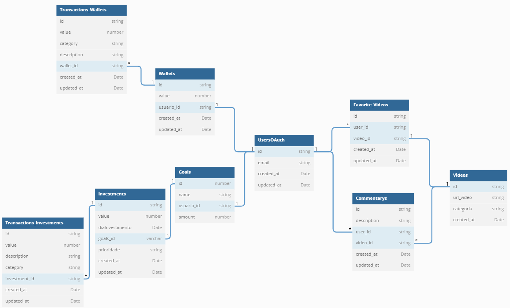

<h1 align="center">API FINANCES</h1>

# User (Usuário)

**RN**
- Verificar se já usuário existe, caso sim lançar erro.

 

## Rotas
- **POST** -> Criar usuário.
- **POST** -> Autenticar usuário.

 
 

# Wallet (Carteira)

**RN**
- Verificar se usuário existe.
- Verificar se carteira já existe, caso exista lançar erro.

 

## Rotas
- **POST** -> Criar carteira.
- **GET** -> Buscar carteira pelo usuário e suas transações.
- **DELETE**

 
 

# Wallet transactions (Transações da Carteira)

**RN**
- Verificar se carteira existe.

 

## Rotas
- **POST** -> Criar transação.
- **GET** -> Buscar todas transações pela carteira.
- **DELETE**

 
 

# Investments (Investimentos)

**RN**
- Verificar se meta existe.

 

## Rotas
- **POST** -> Criar investimento.
- **GET** -> Buscar todos investimentos pela meta.
- **DELETE**

 
 

# Investments transactions (Transações de Investimentos)

**RN**
- Verificar se investimento existe.

 

## Rotas
- **POST** -> Criar transação de investimento.
- **GET** -> Buscar todas transações de investimento pelo investimento.
- **DELETE**

 
 

# Goals (Metas)
 
**RN**
- Verificar se usuário existe.
- Verificar se já existe uma meta com o mesmo nome, caso exista lançar erro.

## Rotas
- **POST** -> Criar meta.
- **GET** -> Buscar todas as metas pelo usuario.
- **GET** -> Buscar meta pelo id da meta passada.
- **DELETE**
 

 
 

# Videos

Os vídeos serão adicionados pelo back-end

 
 
 

# Commentarys (Comentários) ✅

**RN**
- Verificar se usuário existe
- Verificar se id do video passado existe

## Rotas
- **POST** -> Criar comentário. ✅
- **GET** -> Buscar todos os comentários vídeo. ✅
- **DELETE** ✅

 
 
 

# Favorite_Videos (Videos Favoritos) ✅

**RN**
- Verificar se usuário existe
- Verificar se id do video passado existe
- Verificar se o vídeo já foi adicionado aos favoritos, caso sim lançar erro.

## Rotas
- **POST** -> adicionar vídeo favorito. ✅
- **GET** -> Buscar todos os vídeos favoritos usuário. ✅
- **DELETE** ✅

 

